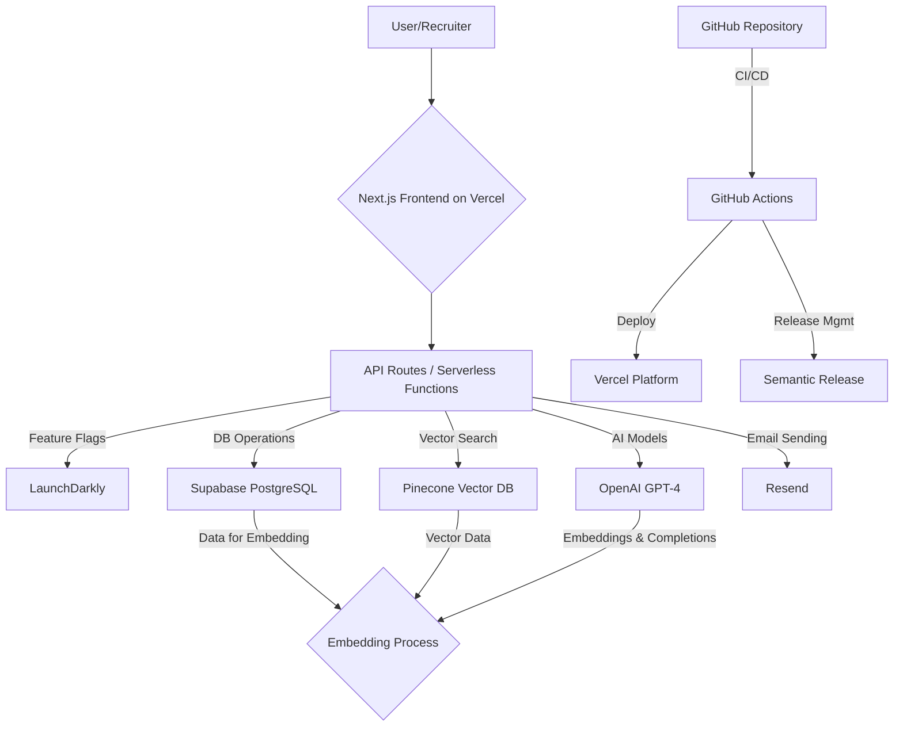

# People GPT Champion

AI-powered platform for identifying and engaging top talent. Built with Next.js, Supabase, Pinecone, OpenAI, and more.

[](https://github.com/<YOUR_GH_USERNAME_OR_ORG>/people-gpt-champion/actions/workflows/ci.yml)
[](https://github.com/semantic-release/semantic-release)

## Table of Contents

- [Live Demo](#live-demo)
- [Architecture](#architecture)
- [Features](#features)
- [Tech Stack](#tech-stack)
- [Getting Started](#getting-started)
  - [Prerequisites](#prerequisites)
  - [Local Setup](#local-setup)
  - [Environment Variables](#environment-variables)
- [Backend Services Setup](#backend-services-setup)
  - [Supabase](#supabase)
  - [Pinecone](#pinecone)
  - [OpenAI](#openai)
  - [LaunchDarkly](#launchdarkly)
  - [Resend](#resend)
- [Deployment](#deployment)
  - [Vercel Setup](#vercel-setup)
  - [Vercel Environment Variables](#vercel-environment-variables)
- [Scripts](#scripts)
- [Contributing](#contributing)
- [License](#license)

## Live Demo

[Link to the live demo will be available here once deployed.]

## Architecture

The following diagram illustrates the high-level architecture of the People GPT Champion platform:



## Features

- AI-driven candidate sourcing and ranking.
- Automated outreach sequences.
- Advanced search and filtering capabilities.
- Feature flagging for controlled rollouts.
- ... more features to be added.

## Tech Stack

- **Framework**: Next.js 14 (App Router)
- **Language**: TypeScript
- **Styling**: Tailwind CSS & shadcn/ui
- **Database**: Supabase (PostgreSQL)
- **Vector Store**: Pinecone
- **AI**: OpenAI (GPT-4 for generation, text-embedding-ada-002 or similar for embeddings)
- **Feature Flags**: LaunchDarkly
- **Email**: Resend
- **CI/CD**: GitHub Actions, Semantic Release
- **Deployment**: Vercel
- **Linting/Formatting**: ESLint, Prettier
- **Testing**: Jest, React Testing Library (stubs)

## Getting Started

### Prerequisites

- Node.js (v18.x or v20.x recommended - see `.nvmrc` if present or CI workflow)
- npm (or yarn/pnpm, though scripts assume npm)
- Git
- Access to accounts for Supabase, Pinecone, OpenAI, LaunchDarkly, and Resend.

### Local Setup

1.  **Clone the repository:**
    ```bash
    git clone https://github.com/<YOUR_GH_USERNAME_OR_ORG>/people-gpt-champion.git
    cd people-gpt-champion
    ```
    *(Replace `<YOUR_GH_USERNAME_OR_ORG>` with the actual GitHub username or organization where this repo lives.)*

2.  **Install dependencies:**
    ```bash
    npm install
    ```

3.  **Set up environment variables:**
    Copy the example environment file and populate it with your API keys and settings:
    ```bash
    cp .env.example .env.local
    ```
    Then, edit `.env.local` with your actual credentials. See the [Environment Variables](#environment-variables) section below for details on each variable.

4.  **Initialize Husky hooks (if not done automatically):**
    ```bash
    npm run prepare
    ```
    This should be run automatically after `npm install` if `prepare` script is configured.

5.  **Run the development server:**
    ```bash
    npm run dev
    ```
    Open [http://localhost:3000](http://localhost:3000) with your browser to see the result.

### Environment Variables

The following environment variables are needed. Copy `.env.example` to `.env.local` for local development and populate it. For deployment, these need to be set in Vercel.

-   `DATABASE_URL`: Your Supabase PostgreSQL connection string.
-   `PINECONE_API_KEY`: Your Pinecone API key.
-   `PINECONE_HOST`: Your Pinecone index host (e.g., `indexname-projectid.svc.environment.pinecone.io`).
-   `PINECONE_INDEX_NAME`: The name of your Pinecone index.
-   `OPENAI_API_KEY`: Your OpenAI API key.
-   `LAUNCHDARKLY_SDK_KEY`: Your LaunchDarkly server-side SDK key.
-   `RESEND_API_KEY`: Your Resend API key.
-   `NEXT_PUBLIC_LAUNCHDARKLY_CLIENT_SIDE_ID`: (Optional, if using client-side LaunchDarkly flags) Your LaunchDarkly client-side ID.

*Make sure `.env.local` is in your `.gitignore` file (it should be by default with Next.js).*

## Backend Services Setup

Detailed instructions on setting up the required third-party services.

### Supabase

1.  Go to [Supabase](https://supabase.com/) and create a new project.
2.  Navigate to **Project Settings** > **Database**.
3.  Under **Connection string**, find your `URI` (it will look like `postgresql://postgres:[YOUR-PASSWORD]@[AWS-REGION].pooler.supabase.com:5432/postgres`). This is your `DATABASE_URL`.
4.  The Prisma schema (`prisma/schema.prisma`) will be used to manage database tables. You can apply it using:
    ```bash
    npx prisma db push
    ```
    *(Ensure your `.env.local` has the correct `DATABASE_URL` before running this.)*

### Pinecone

1.  Go to [Pinecone](https://www.pinecone.io/) and create an account/log in.
2.  Create a new **Index**:
    -   **Index Name**: Choose a name (e.g., `people-gpt-champion`). This will be your `PINECONE_INDEX_NAME`.
    -   **Dimensions**: `1536` (for OpenAI's `text-embedding-ada-002` or similar).
    -   **Metric**: Cosine (recommended for sentence embeddings).
    -   Choose your desired pod type and cloud provider.
3.  Once the index is initialized, find your **API Key** and **Host** (previously Environment) in the Pinecone console. The host is part of the index URL.

### OpenAI

1.  Go to [OpenAI Platform](https://platform.openai.com/) and create an account/log in.
2.  Navigate to **API keys** and create a new secret key. This is your `OPENAI_API_KEY`.
3.  Ensure your account has access to GPT-4 models and embedding models.

### LaunchDarkly

1.  Go to [LaunchDarkly](https://launchdarkly.com/) and create an account/log in.
2.  Create a new **Project**.
3.  Navigate to **Account settings** > **Projects**, select your project, then find your **SDK key** for the server-side environment. This is your `LAUNCHDARKLY_SDK_KEY`.
4.  (Optional) If you plan to use client-side feature flags, also note the **Client-side ID**.
5.  Define your initial feature flags in the LaunchDarkly dashboard (e.g., `streamingSearch`, `multiChannelOutreach`).

### Resend

1.  Go to [Resend](https://resend.com/) and create an account/log in.
2.  Verify your sending domain (e.g., `yourapp.com`). Emails must be sent from a verified domain.
3.  Navigate to **API Keys** and create a new API key. This is your `RESEND_API_KEY`.

## Deployment

This project is configured for deployment on [Vercel](https://vercel.com/).

### Vercel Setup

1.  Go to [Vercel](https://vercel.com/) and sign up or log in with your GitHub account.
2.  Click on **Add New...** > **Project**.
3.  **Import Git Repository**: Select your `people-gpt-champion` GitHub repository.
4.  Vercel will automatically detect it as a Next.js project.
5.  Configure the **Project Name** and **Root Directory** (should be default).
6.  Before deploying, configure the environment variables as described below.

### Vercel Environment Variables

In your Vercel project settings, navigate to **Settings** > **Environment Variables**. Add all the variables listed in the [Environment Variables](#environment-variables) section with their respective values obtained from Supabase, Pinecone, OpenAI, LaunchDarkly, and Resend.

- `DATABASE_URL`
- `PINECONE_API_KEY`
- `PINECONE_HOST`
- `PINECONE_INDEX_NAME`
- `OPENAI_API_KEY`
- `LAUNCHDARKLY_SDK_KEY`
- `RESEND_API_KEY`
- `NEXT_PUBLIC_LAUNCHDARKLY_CLIENT_SIDE_ID` (if used)

Once configured, Vercel will build and deploy your project automatically on pushes to the main branch (or other configured branches).

## Scripts

- `npm run dev`: Starts the development server.
- `npm run build`: Builds the application for production.
- `npm run start`: Starts a production server (after build).
- `npm run lint`: Lints the codebase using Next.js ESLint integration.
- `npm run format:check`: Checks code formatting with Prettier.
- `npm run format:write`: Formats code with Prettier.
- `npm test`: Runs tests using Jest.
- `npm run prepare`: Sets up Husky hooks (usually run automatically on install).

## Contributing

Contributions are welcome! Please follow these steps:
1. Fork the repository.
2. Create a new branch (`git checkout -b feature/your-feature-name`).
3. Make your changes, adhering to conventional commit message standards.
4. Commit your changes (`git commit -m "feat: Add some feature"`).
5. Push to the branch (`git push origin feature/your-feature-name`).
6. Open a Pull Request.

## License

This project is licensed under the MIT License - see the [LICENSE](LICENSE) file for details.
